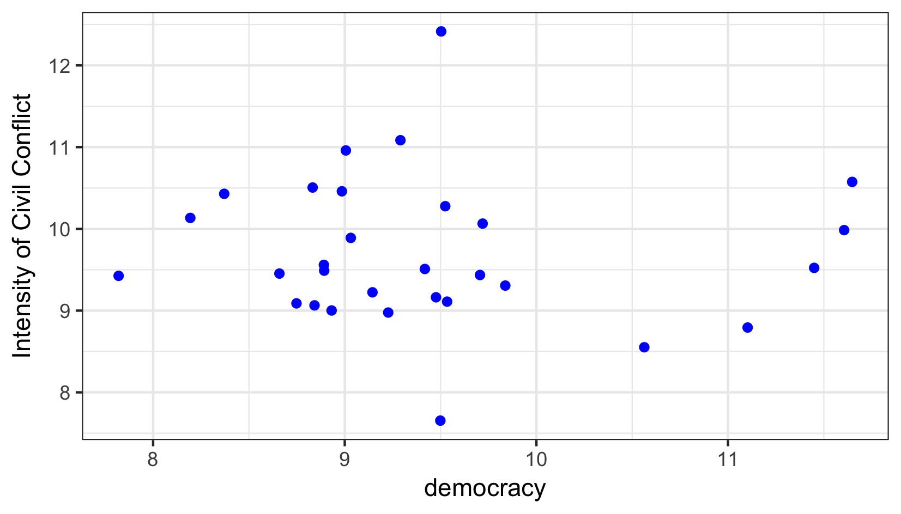
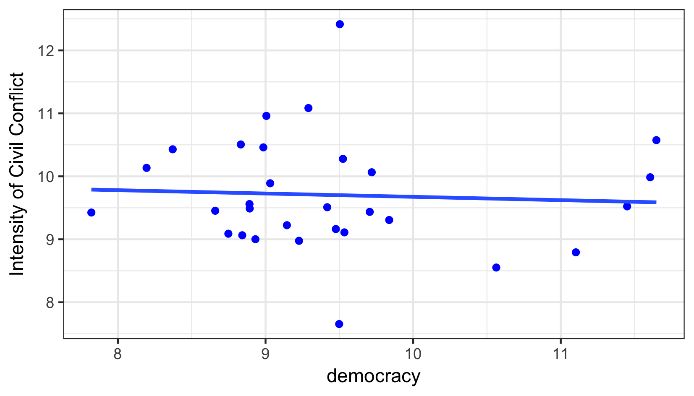
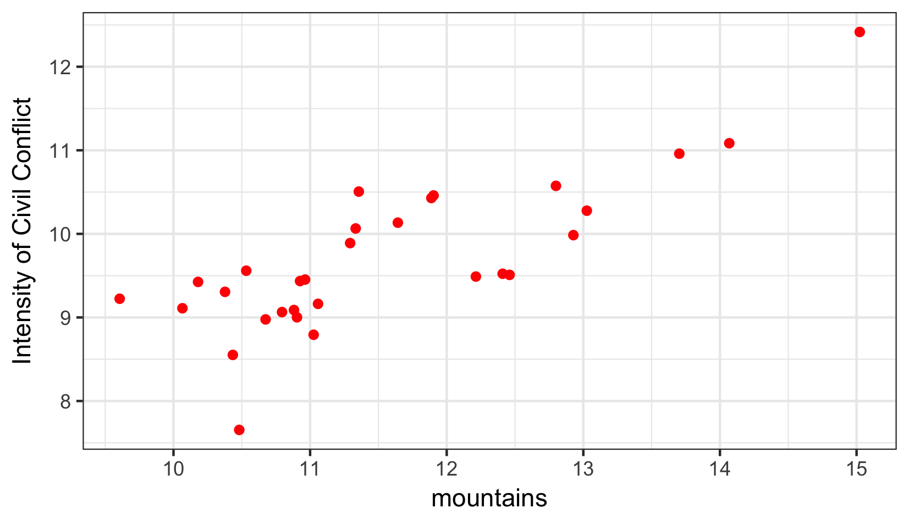
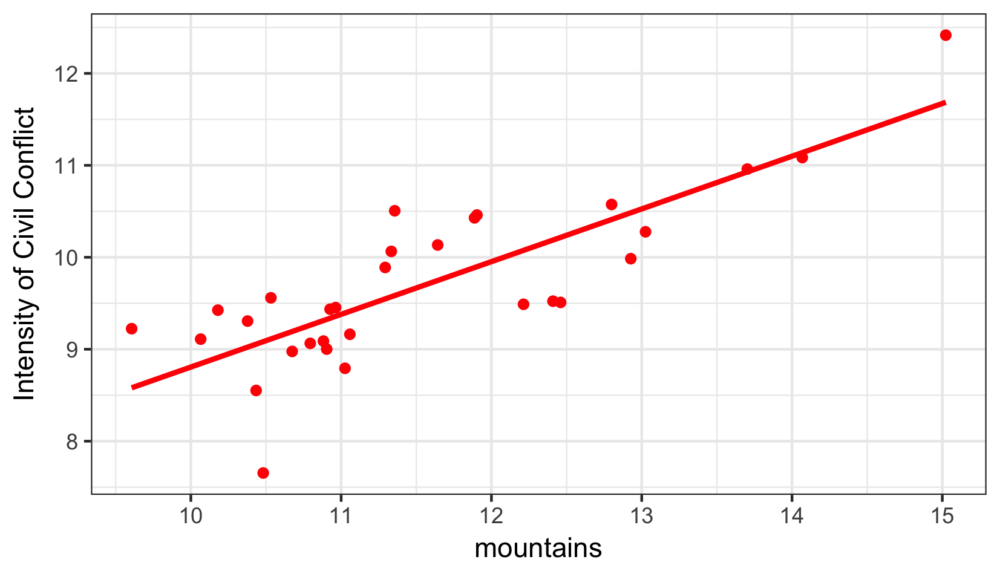
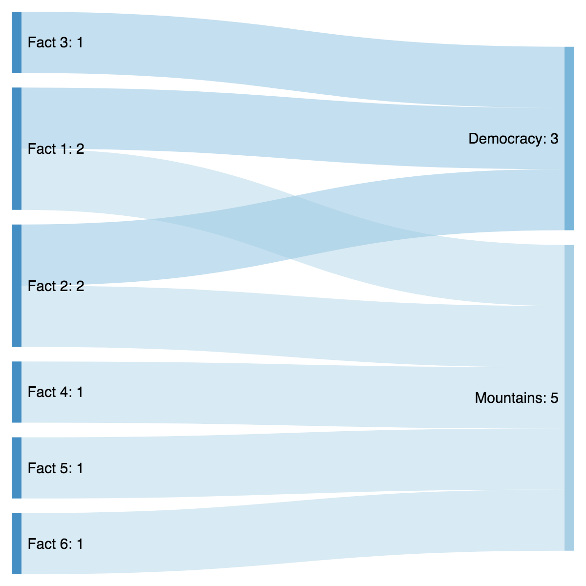

```{r setup, include=FALSE}
knitr::opts_chunk$set(echo = FALSE)
```

## Social Sciences $\neq$ History

- The Question **historians** try to answer

    - **What actually happened**

- The Question **social scientists** try to answer

    - **Why do something happen / exist**

-  $Outputs / Outcomes$ $\leftarrow$ $Inputs$

- Social Research = $Input \rightarrow Mechanism \rightarrow Output$

## Real Sciences Way
- 1. Do some initial experiment (mixture of ingredients $\rightarrow$ speed of chemical reaction)
- 2. Change your inputs (add an extra ingredient) $\rightarrow$
- 3. Look if your output changed

## Can we do it in social sciences?

- \pause sometimes

    - social scientists cannot "change the input"

- What they usually do?

    - look for a proper comparison unit / group

## Some examples

- Terrorist attacks 
    
    - (France, 15 VS France, 21)
    
    - (Germany, 21 VS France, 21)
    
## Social Science Research Question

- **Why does something happen in one places, but not in the others?**

- Yes or No:
    
    - Why do some nations become rich, while other stay poor?
    - Why do some nations make war on each other?
    - Why did Donald Trump / Barack Obama win the election?
    - Lack a group for comparison. \pause Alternative?
    - Why did Russia fail to democratize?
    - Alternative?

## A social sciences way of doing research: steps

1. Outcome of Interest: *Intensity of Civil Conflicts*

2. List of potential explanations:

    - Lack of Democracy -> Grievances -> Conflict
    - Mountains -> Hard to detect -> Opportunity -> Conflict

3. Data:
  - output: counts (cases of civil tensions, civil war) or index
  - input 1: how to measure democracy. Ideas?
  - input 2: how to measure mountains?

## How do we make conclusions?
<center>
</center>

## How do we make conclusions?
<center>
</center>


## How do we make conclusions?
<center>
</center>


## How do we make conclusions?
<center>
</center>

## Qualitative Approach: List of facts
<center>
</center>

## Next Steps

- Theories?

  - Readings
  
- Data / Facts 
  
  - Readings / Lecture Notes
  - Huge amount of outside data
  